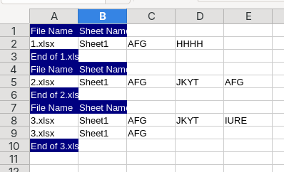

Excelactor

A Rust tool for bulk searching and extracting data from multiple Excel files

Overview

This tool  processes a folder of Excel files (.xlsx), searches for rows containing a specified keyword, and exports the results to an excel file..
Key Features

✔ Bulk processing - Scan multiple Excel files in one operation

✔ Keyword search - Extract rows or columns containing your search term

✔ Fast Performance: Rust's concurrency features are fully utilized for max performance

✔ Merged cell support - Properly handles merged rows/columns

✔ Output is exported as an excel file

Current Status

✅ Implemented:

    Row extraction with keyword matching

    Merged row support

    Multi-threading for fast process

🛠 How to build (install cargo if you dont already have it):

    cargo install --release excelactor

Example Output:

Usage

    Run the executable(type excelactor in command line)

    Select folders containing the excel files

    Enter your search keyword

    Enter Sheet name (leave empty if you want all sheets searched)

    Say whether you want columns or rows to be extracted

    Results will be saved in results.xlsx
